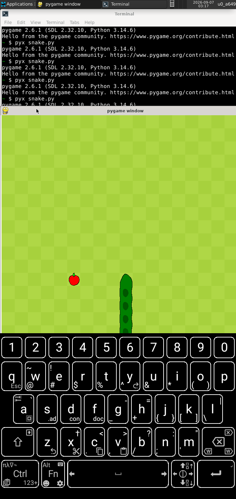
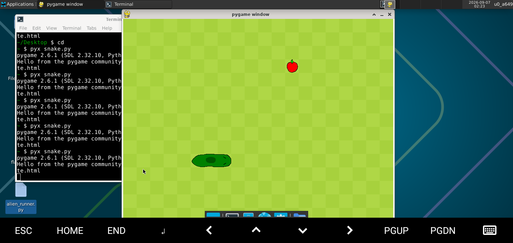
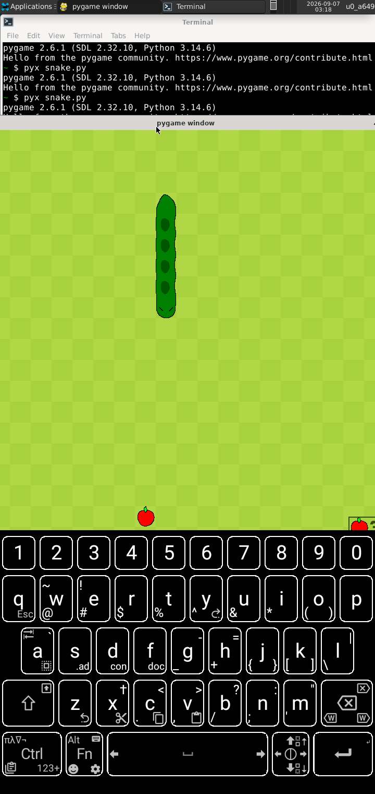

# snake-game
A snake game built with pythons pygame module for my Game Development journey. Made entirely on phone.

# Apps and IDEs i used for this Development
- Termux as my main terminal
- NVIM in termux as my IDE
- Termux:x11 as a way to render a window with my phone.

# Screenshots

